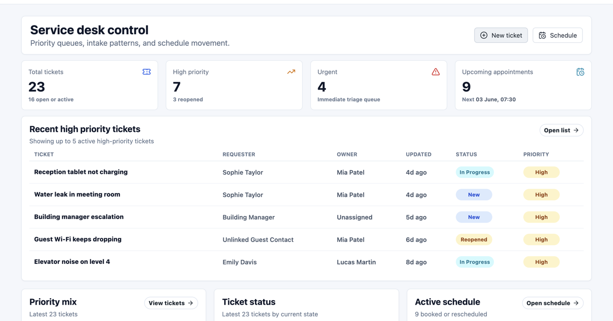

# Multiapp Frontend

[](https://github.com/jastoninfer/multiapp-frontend/actions/workflows/frontend-ci-cd.yml)

React frontend for **Multiapp**, a multi-tenant ticketing and appointment SaaS demo. The UI is built for tenant admins, agents, resource users, and customers.

- Live demo: [https://multiapp-frontend.pages.dev](https://multiapp-frontend.pages.dev)
- Backend repository: [https://github.com/jastoninfer/multiapp-backend](https://github.com/jastoninfer/multiapp-backend)



## What This Frontend Does

- Uses Keycloak authorization-code login with PKCE.
- Refreshes tokens so the demo session lasts longer.
- Lets users switch between tenants.
- Sends `X-Tenant-Id` on tenant-scoped API calls.
- Shows navigation and actions based on the user's role.
- Supports tickets, appointments, contacts, members, tenant settings, resources, availability, profile, and audit logs.
- Uses reusable table, filter, detail, pagination, and form patterns.

## Stack

- React 18
- TypeScript
- Vite
- React Router
- TanStack Query
- Lucide React
- Plain CSS in `src/styles.css`
- GitHub Actions
- Cloudflare Pages

## Main Workflows

| Workflow | Routes / files |
| --- | --- |
| Login and callback | `/auth/callback`, `src/auth`, `src/pages/AuthCallbackPage.tsx` |
| Tenant switching and layout | `src/components/Layout.tsx`, `src/hooks/useCurrentTenant.ts` |
| Ticket list and detail | `/tickets`, `/tickets/:id` |
| New ticket | `/tickets/new` |
| Appointments | `/appointments`, `/appointments/:id` |
| Resource availability | `/resources`, `/resources/:resourceUserId/availability` |
| Contacts | `/contacts`, `/contacts/claim`, `/contacts/:contactId` |
| Members and tenant settings | `/members`, `/members/:userId`, `/tenant` |
| Audit logs | `/audit-logs` |

## CI/CD

CI/CD means the app is built and deployed through the same repeatable steps after each change.

For this frontend:

- **CI** runs on pull requests and pushes to `main`.
- It installs dependencies with `npm ci`.
- It runs the TypeScript and Vite production build with `npm run build`.
- **CD** runs only for `main`.
- The deploy job uploads the built `dist/` folder to Cloudflare Pages.
- A smoke test checks that the deployed frontend responds.

The workflow file is:

```text
.github/workflows/frontend-ci-cd.yml
```

Required GitHub secrets:

```text
CLOUDFLARE_API_TOKEN
CLOUDFLARE_ACCOUNT_ID
```

Required GitHub variables for deployment:

```text
CLOUDFLARE_PAGES_PROJECT
FRONTEND_URL
VITE_API_BASE_URL
VITE_KEYCLOAK_URL
VITE_KEYCLOAK_REALM
VITE_KEYCLOAK_CLIENT_ID
```

Private or deployment-specific values are kept in GitHub settings, not in this README.

## Environment

Create a local env file from the example:

```bash
cp .env.example .env.local
```

Required variables:

```env
VITE_API_BASE_URL=http://api.localhost
VITE_KEYCLOAK_URL=http://auth.localhost
VITE_KEYCLOAK_REALM=multiapp
VITE_KEYCLOAK_CLIENT_ID=multiapp-web
```

Vite embeds these values at build time. If an API/Auth URL changes, rebuild the frontend.

## Run Locally

```bash
npm install
npm run dev
```

Open:

```text
http://localhost:5173
```

For the local Caddy-backed demo build:

```bash
npm run build -- --mode caddy-local
```

The static output is written to:

```text
dist/
```

## Build

```bash
npm run build
```

Preview the production build locally:

```bash
npm run preview
```

## Demo Accounts

All demo accounts use `Demo123!`.

| Role | Account |
| --- | --- |
| Tenant admin | `tenant.admin@acme.demo` |
| Agent | `agent@acme.demo` |
| Resource user | `resource@acme.demo` |
| Customer | `customer@acme.demo` |

## Backend Pairing

This frontend expects the backend API to provide:

- OIDC-protected `/me` endpoint with user and tenant data.
- Tenant-scoped APIs for tickets, appointments, contacts, members, resources, tenants, and audit logs.
- `Authorization: Bearer <access_token>`.
- `X-Tenant-Id` for tenant-scoped business endpoints.
- `ETag` / `If-Match` on update flows where required.

See the backend repository for Docker Compose, Keycloak setup, Flyway migrations, and backend deployment.
